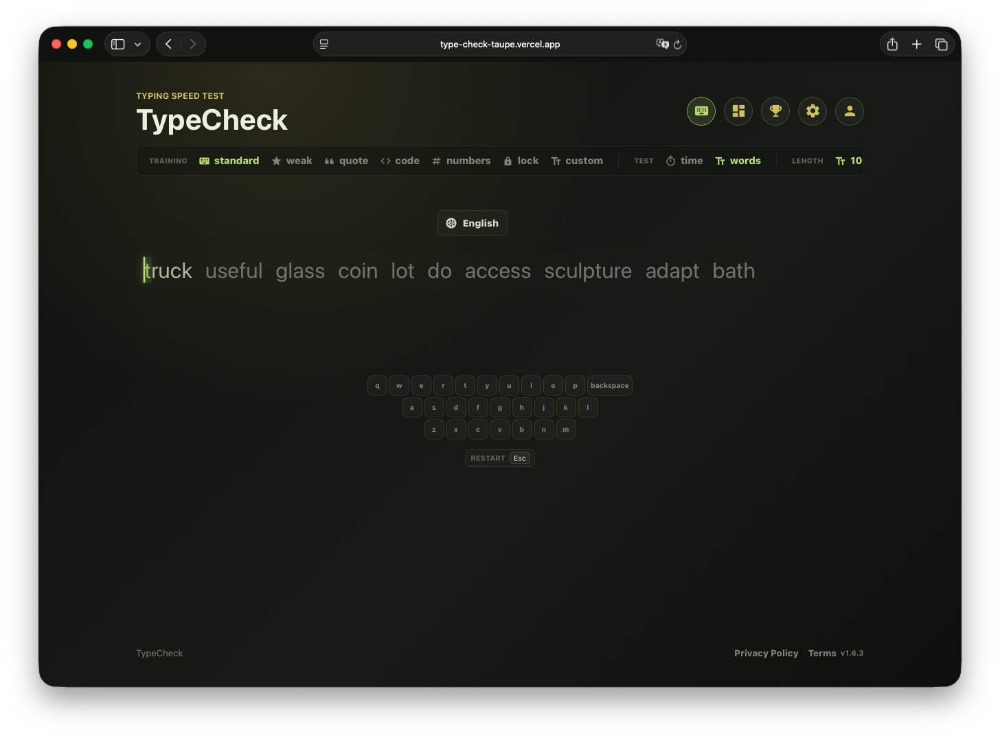

# TypeCheck
[](https://github.com/Positiveoo1/typeCheck/actions/workflows/ci.yml)
[](LICENSE)
[](CONTRIBUTING.md)
[](package.json)

TypeCheck v1.7.2 is a friendly typing speed test built with Next.js, React, and Firebase. It measures typing speed, accuracy, mistakes, and progress over time, with training modes, theme unlocks, keyboard feedback, profile pages, and a leaderboard.

## Demo



**[Try it live →](https://type-check-taupe.vercel.app)**

## Features

- Timed tests: `15s`, `30s`, `60s`, and custom time values from 5 to 300 seconds.
- Word-count tests: `10 words`, `30 words`, and `60 words`.
- Training modes:
  - `Standard`: balanced common words.
  - `Weak letters`: awkward letters and same-hand patterns.
  - `Quotes`: sentence rhythm, capitals, and punctuation.
  - `Code`: developer-style casing, symbols, and snippets.
  - `Numbers`: digits and compact punctuation-heavy tokens.
  - `Accuracy lock`: ends a run after five live mistakes.
- Typing stats: WPM, accuracy, correct characters, wrong characters, elapsed time, and mode labels.
- Dashboard and profile history for signed-in users.
- Public player profiles and leaderboard entries.
- Theme personalities with unlock conditions.
- Optional visual keyboard and key sounds.
- Privacy and terms screens.
- SEO metadata, robots.txt, and sitemap support.

## Tech Stack

- Next.js `15`
- React `19`
- Firebase Auth and Firestore
- Framer Motion
- Node.js built-in test runner

## Requirements

- Node.js `18.18.0` or newer
- npm
- Firebase project, if you want auth, profiles, dashboards, and leaderboard persistence

The typing test can still run without Firebase configuration. Account-related features are guarded by the Firebase configuration check.

## Getting Started

Install dependencies:

```bash
npm install
```

Start the development server:

```bash
npm run dev
```

Open the app at:

```text
http://localhost:3000
```

## Available Scripts

```bash
npm run dev
```

Runs the Next.js development server.

```bash
npm run build
```

Creates a production build.

```bash
npm run start
```

Starts the production server after a build.

```bash
npm test
```

Runs the typing logic test suite with Node's built-in test runner.

## Environment Variables

Firebase settings are read from `NEXT_PUBLIC_*` variables. The Next.js config also accepts matching `VITE_*` names as fallbacks.

Create or update `.env` with:

```env
NEXT_PUBLIC_FIREBASE_API_KEY=
NEXT_PUBLIC_FIREBASE_AUTH_DOMAIN=
NEXT_PUBLIC_FIREBASE_PROJECT_ID=
NEXT_PUBLIC_FIREBASE_STORAGE_BUCKET=
NEXT_PUBLIC_FIREBASE_MESSAGING_SENDER_ID=
NEXT_PUBLIC_FIREBASE_APP_ID=
NEXT_PUBLIC_RECAPTCHA_ENTERPRISE_SITE_KEY=
NEXT_PUBLIC_SITE_URL=http://localhost:3000
```

Optional sitemap data sources:

```env
SITEMAP_MENU_SLUGS_URL=
SITEMAP_BLOG_SLUGS_URL=
```

`NEXT_PUBLIC_SITE_URL` is used for canonical metadata, Open Graph URLs, robots.txt, and sitemap generation.

## Firebase Data Model

The app expects these Firestore areas when Firebase is configured:

- `users/{userId}`: profile and account metadata.
- `users/{userId}/stats/dashboard`: aggregate dashboard statistics.
- `users/{userId}/results/{resultId}`: individual typing results.
- `publicPlayers/{userId}`: public display data for profile and leaderboard links.
- `leaderboardResults/{resultId}`: leaderboard-visible typing results.

Auth is used for sign-in state, password reset email, password linking, password changes, sign-out, and recent-login checks.

Firestore security rules are defined in `firestore.rules`. Deploy them after
selecting the Firebase project:

```bash
firebase use typecheck-e1830
firebase deploy --only firestore:rules
```

If saving a result logs `Missing or insufficient permissions`, the deployed
Firestore rules do not allow the app's expected authenticated writes yet. A
separate `net::ERR_BLOCKED_BY_CLIENT` line is usually caused by a browser
extension or privacy blocker interrupting a Firestore network request.

## App Navigation

The UI supports real Next routes while preserving old hash links as redirects:

- `/`: typing test
- `/dashboard`: dashboard
- `/leaderboard`: leaderboard
- `/profile`: signed-in user profile
- `/settings`: settings
- `/privacy`: privacy page
- `/terms`: terms page
- `/player/{userId}`: public profile

## Project Structure

```text
app/
  layout.jsx        Root layout and global stylesheet import
  page.jsx          Main page that renders the TypeCheck app
  robots.ts         robots.txt metadata route
  sitemap.ts        sitemap.xml metadata route

public/
  audio/            Key sound asset
  favicon.png       Site favicon
  logo.png          Public logo
  social-preview.png

src/
  App.jsx           Main client app, routing, settings, auth state, persistence
  legal.js          Legal content version
  styles.css        Global application styles
  trainingModes.js  Training mode definitions and target text generation
  typingLogic.js    Core typing helpers and stats calculations
  typingLogic.test.js
  languages/        Language-specific word lists

  components/       UI components for typing, auth, dashboard, profile, etc.
  services/         Firebase config and runtime exports
```

## Core Logic

`src/typingLogic.js` contains the shared pure functions for:

- generating randomized word sequences
- calculating WPM and accuracy
- tokenizing target text into words and letters
- labeling modes
- calculating time left
- controlling typed-text updates and paste/autofill jumps

`src/trainingModes.js` builds target text for each training mode. Time-based tests generate a fixed-length target, while word-count tests generate the selected number of words.

`src/components/TypingTest.jsx` owns the interactive typing run: focus management, timers, keyboard state, key sounds, caret placement, accuracy-lock behavior, and finish events.

## Testing

Run:

```bash
npm test
```

Current tests cover:

- WPM and accuracy calculations
- mistake counting
- strict/backspace typing behavior
- paste/autofill limiting
- time and mode helpers
- training target generation
- word token indexes

## Contributing

Contributions are welcome — bug fixes, new training modes, new language word lists, or UI improvements. See [CONTRIBUTING.md](CONTRIBUTING.md) for setup instructions, test/lint requirements, and PR conventions.

## Deployment Notes

Before deploying:

1. Set all required Firebase environment variables in the hosting provider.
2. Set `NEXT_PUBLIC_SITE_URL` to the production site origin.
3. Run `npm run build`.
4. Deploy `firestore.rules` and confirm Firebase Auth providers match the app's expected collections.

For a static typing-test-only version, Firebase variables can be omitted, but account, dashboard, profile, and leaderboard persistence will not be available.

## Development Notes

- Settings and theme choices are stored in `localStorage`.
- Firebase modules are lazy-loaded from the client app to keep the unauthenticated typing experience lighter.
- Theme availability is calculated from dashboard progress and best results.
- Do not commit real Firebase secrets or private local environment values.
